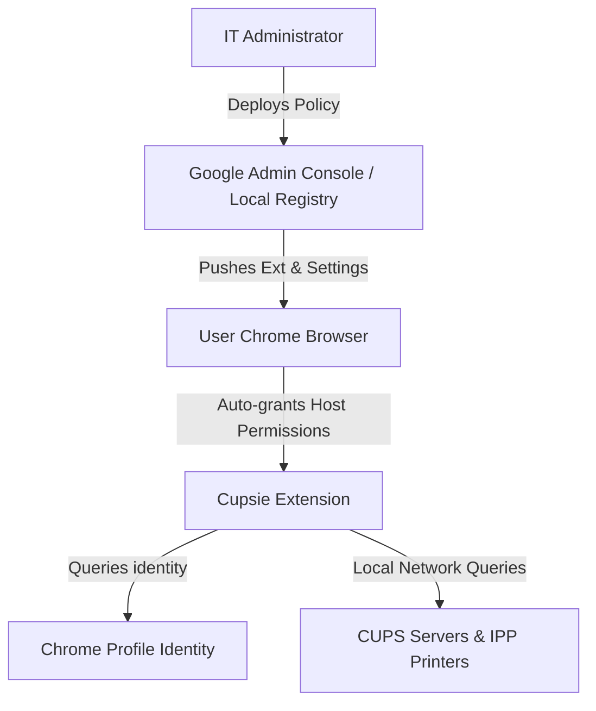

# Cupsie Printer Provider (Enterprise Edition)

**Cupsie Printer Provider** is an enterprise-oriented Chrome extension that enables system administrators to centrally deploy and configure CUPS print queues and standalone IPP/IPPS printers directly into the native Chrome Print Dialog using Chrome's `printerProvider` API.

It is designed to be **zero-touch** for end users, allowing administrators to push printer configurations silently via Chrome Managed Storage policies.

---

## Key Enterprise Features

* **Zero-Touch Deployment**: Silently force-install the extension and push pre-configured CUPS servers and standalone IPP printers. End users receive no permission prompts.
* **Auto-Identity Resolution**: Queries the user's active Chrome Profile using the `identity` API to negotiate printing authorization on CUPS servers automatically, or can be overridden via policy.
* **Native Chrome Print Integration**: Integrates IPP/CUPS printers seamlessly into the Chrome browser print destination picker.
* **Robust Capabilities Mapping**: Queries printer capabilities via IPP (paper sizes, tray selection, duplex, color, print scaling, stapling, hole punching, folding, etc.) and maps them to Chrome print settings automatically.
* **Managed Policy Precedence**: Configurations pushed via enterprise policy override or take precedence over manual user configurations.
* **Diagnostics & Troubleshooting**: Includes a built-in logging UI to inspect connection status, policy validation, and printer response codes.
* **Robust Background Printing**: Leverages a Chrome Offscreen Document keep-alive connection during active print cycles to prevent Chrome's memory optimizers from terminating the service worker during large print job transfers.

---

## Enterprise Deployment Guide

### 1. Overview of Enterprise Architecture



### 2. Managed Policy Schema Reference

Configure extension behavior by defining values matching the schema:

| Policy Key | Type | Description |
| :--- | :--- | :--- |
| `cupsServers` | Array of Strings | A list of network CUPS server URLs/IPs (e.g., `["http://cups.domain.local:631"]`). |
| `ippPrinters` | Array of Objects | Standalone IPP network printer endpoints. Each item must have a `url` (string) and an optional friendly `name` (string). |
| `syncInterval` | Integer | Background printer discovery poll interval in minutes (min: `1`, max: `1440`). |
| `defaultRequestingUser` | String | Overrides the username sent with IPP/CUPS request metadata. |

### 3. Deploying via Google Admin Console (Cloud-Managed Chrome)

1. Sign in to the [Google Admin Console](https://admin.google.com).
2. Navigate to **Devices > Chrome > Apps & extensions > Users & browsers**.
3. Select the target Organizational Unit (OU) on the left.
4. Click the yellow **`+`** button and select **Add from Chrome Web Store** or **Add by extension ID**.
5. Search for/add **Cupsie** (Extension ID: `dekecaodhfljnecmmkenlmjfcbmdokno`).
6. Set the **Installation policy** to **Force install** (this automatically installs the extension silently).
7. Under the **Policy for extensions** text box, paste your JSON configuration:

```json
{
  "cupsServers": {
    "Value": [
      "http://cups-server.internal:631"
    ]
  },
  "ippPrinters": {
    "Value": [
      {
        "url": "http://10.0.1.54:631/ipp/print",
        "name": "HQ 1st Floor Copier"
      },
      {
        "url": "http://10.0.1.55:631/ipp/print",
        "name": "HQ 2nd Floor Copier"
      }
    ]
  },
  "syncInterval": {
    "Value": 1440
  },
  "defaultRequestingUser": {
    "Value": "employee"
  }
}
```
8. Click **Save** in the top right.

### 4. Deploying via Local Managed Policy (Linux Workstations)

For Linux workstations managed via config management tools (e.g., Ansible, Puppet), save the JSON policy file to `/etc/opt/chrome/policies/managed/cupsie_policy.json`. Force-installing the extension automatically grants required host access permissions without user prompts:

```json
{
  "ExtensionSettings": {
    "dekecaodhfljnecmmkenlmjfcbmdokno": {
      "installation_mode": "force_installed",
      "update_url": "https://clients2.google.com/service/update2/crx",
      "runtime_allowed_hosts": [
        "<all_urls>"
      ]
    }
  },
  "3rdparty": {
    "extensions": {
      "dekecaodhfljnecmmkenlmjfcbmdokno": {
        "cupsServers": [
          "http://cups-server.internal:631"
        ],
        "ippPrinters": [
          {
            "url": "http://10.0.1.54:631/ipp/print",
            "name": "HQ 1st Floor Copier"
          },
          {
            "url": "http://10.0.1.55:631/ipp/print",
            "name": "HQ 2nd Floor Copier"
          }
        ],
        "syncInterval": 1440,
        "defaultRequestingUser": "employee"
      }
    }
  }
}
```

---

## How the Policy Works

### For the Administrator
1. **Validation & Logging**: When performing a printer synchronization cycle, the extension automatically validates the incoming policy values. If any configured URL is malformed, or if `syncInterval` falls outside boundaries, details are logged in the background diagnostic logs.
2. **Connectivity Diagnostics**: If any of the pushed CUPS servers or printers are offline or unreachable, the background script writes an error log: `Server/Printer is unreachable: <Resource> is unreachable. Error: <Details>`, allowing administrators to troubleshoot connection routes.

### For the End User
1. **Zero Configuration**: Once the extension is pushed, it is silently installed. Configured CUPS queues and standalone printers instantly appear in the native Chrome print destination selector (`Ctrl + P` / `Cmd + P`).
2. **Configuration Display**: On the extension **Options** page, managed configurations are displayed in read-only input blocks marked with a **(Managed by Policy)** badge. Users cannot delete or edit these settings.
3. **Coexistence**: Users can still add their own personal CUPS servers or standalone printers. Personal settings are saved in `chrome.storage.sync` and merge/coexist alongside the enterprise-managed configuration.

---

## Manual & Ad-Hoc Configuration (Optional Feature)

While Cupsie is optimized for enterprise management, users or administrators can also configure printers manually on individual devices.

### Manual Installation
Open the [Cupsie Extension](https://chromewebstore.google.com/detail/dekecaodhfljnecmmkenlmjfcbmdokno/) on the Chrome Web Store and click **Add to Chrome**.

### Adding Printers Manually
1. Open the extension **Options** page (right-click the extension icon and select **Options**, or navigate to `chrome://extensions` and click **Extension options**).
2. **Adding CUPS Print Servers**:
   - Under **CUPS Servers**, enter your CUPS server IP addresses or URLs (one per line).
   - *Example*: `http://192.168.1.10:631` or `https://cups-server.example.com`
   - The extension automatically connects to each server and fetches all available printer queues.
3. **Adding Standalone IPP Printers**:
   - Under **Standalone IPP Printers**, enter the direct IPP URL endpoint and an optional friendly display name.
   - *Example*:
     - **URL**: `http://192.168.1.50:631/ipp/print`
     - **Name**: `Office Color Laser`
   - Click **+ Add Another Printer** to add more printers.
4. **Background Sync Interval**:
   - Adjust the **Background Sync Interval (minutes)** to control how frequently Cupsie polls your servers and printers for state changes.
   - Click **Save Settings** to persist configuration and trigger an immediate printer sync.

---

## Privacy & Security

By default, the extension does not send any data to external servers. All printer communication is performed locally from your browser to your print servers and printers.

For more details, see the full [Privacy Policy](privacy_policy.md).
