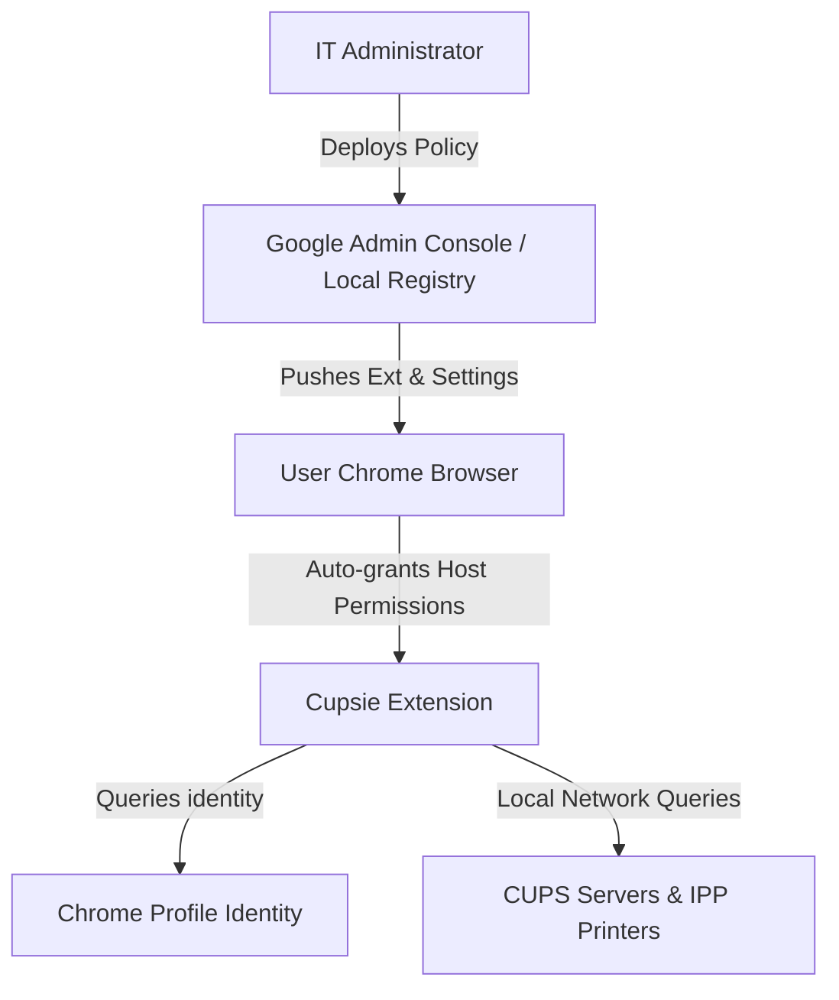

# Cupsie Enterprise Deployment & Policy Guide

This guide describes how system administrators can centrally deploy, configure, and manage the **Cupsie Printer Provider** extension across an organization.

---

## 1. Overview of Enterprise Architecture

For enterprise environments, Cupsie is designed to be **zero-touch** for users and fully controlled by administrators.



### Key Enterprise Design Patterns:
* **Default Host Permissions**: Cupsie declares default host permissions for `*://*/*`. Users never receive permissions prompts upon installation or server configuration.
* **Auto-Identity Resolution**: If not overridden by policy, the extension queries the user's active Chrome Profile using the `identity` API, extracts their username from the profile email (e.g., `bob` from `bob@company.com`), and uses it to negotiate printing authorization on CUPS servers. Administrators can explicitly embed this resolved username in the `defaultRequestingUser` field using the `"${user_name}"` placeholder (e.g. `"prefix_${user_name}"`).
* **Managed Precedence**: Enterprise configuration settings loaded from Chrome Managed Storage override or take precedence over the user's manual settings.

---

## 2. Policy Schema Reference

Administrators configure the extension behavior by defining values matching the schema (`schema.json`).

| Policy Key | Type | Description |
| :--- | :--- | :--- |
| `cupsServers` | Array of Strings | A list of network CUPS server URLs/IPs (e.g., `["http://cups.domain.local:631"]`). |
| `ippPrinters` | Array of Objects | Standalone IPP network printer endpoints. Each item must have a `url` (string) and an optional friendly `name` (string). |
| `syncInterval` | Integer | Background printer discovery poll interval in minutes (min: `1`, max: `1440`). |
| `defaultRequestingUser` | String | Overrides the username sent with IPP/CUPS request metadata. |

---

## 3. Administrator Setup: Pushing Configuration

Administrators can push configurations using two primary methods depending on their device management infrastructure.

### Method A: Deploying via Google Admin Console (Cloud-Managed Chrome)

1. Sign in to the [Google Admin Console](https://admin.google.com).
2. Navigate to **Devices > Chrome > Apps & extensions > Users & browsers**.
3. Select the target Organizational Unit (OU) on the left.
4. Click the yellow **`+`** button and select **Add from Chrome Web Store** or **Add by extension ID**.
5. Search for/add **Cupsie** (Extension ID: `dekecaodhfljnecmmkenlmjfcbmdokno`).
6. Set the **Installation policy** to **Force install**. This automatically installs the extension silently on user devices.
7. Under the **Policy for extensions** text box, paste your JSON configuration. 
   > [!IMPORTANT]
   > When deploying via the Admin Console, schema fields must be wrapped in a `"Value"` block:

```json
{
  "cupsServers": {
    "Value": [
      "http://cups-server.internal:631"
    ]
  },
  "ippPrinters": {
    "Value": [
      {
        "url": "http://10.0.1.54:631/ipp/print",
        "name": "HQ 1st Floor Copier"
      },
      {
        "url": "http://10.0.1.55:631/ipp/print",
        "name": "HQ 2nd Floor Copier"
      }
    ]
  },
  "syncInterval": {
    "Value": 1440
  },
  "defaultRequestingUser": {
    "Value": "employee"
  }
}
```
8. Click **Save** in the top right.

---

### Method B: Deploying via Local Managed Policy (Linux Workstations)

For Linux workstations managed via config management tools (e.g. Ansible, Puppet), save a JSON policy file to `/etc/opt/chrome/policies/managed/cupsie_policy.json`.

> [!IMPORTANT]
> When using local 3rd-party policies, values are defined flat under the `"3rdparty"` extension block without the `"Value"` wrapper:

```json
{
  "ExtensionSettings": {
    "dekecaodhfljnecmmkenlmjfcbmdokno": {
      "installation_mode": "force_installed",
      "update_url": "https://clients2.google.com/service/update2/crx"
    }
  },
  "3rdparty": {
    "extensions": {
      "dekecaodhfljnecmmkenlmjfcbmdokno": {
        "cupsServers": [
          "http://cups-server.internal:631"
        ],
        "ippPrinters": [
          {
            "url": "http://10.0.1.54:631/ipp/print",
            "name": "HQ 1st Floor Copier"
          },
          {
            "url": "http://10.0.1.55:631/ipp/print",
            "name": "HQ 2nd Floor Copier"
          }
        ],
        "syncInterval": 1440,
        "defaultRequestingUser": "employee"
      }
    }
  }
}
```

---

## 4. How the Policy Works

### For the Administrator
1. **Validation & Logging**: 
   When the extension performs a printer synchronization cycle, it automatically validates the incoming policy values. If any configured printer/server URL is malformed, or if `syncInterval` falls outside boundaries, the extension logs a detailed complaint in the background diagnostic logs.
2. **Connectivity Diagnostics**:
   If any of the pushed CUPS servers or printers are offline or unreachable, the background script writes an error log:
   `Server/Printer is unreachable: <Resource> is unreachable. Error: <Details>`
   This allows the administrator to check user diagnostic logs to verify network routes and printer availability.

### For the End User
1. **Zero Configuration**: 
   Once the extension is pushed, it is silently installed. The configured CUPS queues and standalone printers instantly appear in the native Chrome print destination selector (`Ctrl + P` / `Cmd + P`).
2. **Configuration Display**:
   On the extension **Options** page, managed configurations are displayed in read-only input blocks marked with a **(Managed by Policy)** badge. Users cannot delete or edit these settings.
3. **Coexistence**:
   Users can still add their own personal CUPS servers or standalone printers. Personal settings are saved in `chrome.storage.sync` and merge/coexist alongside the enterprise-managed configuration.
